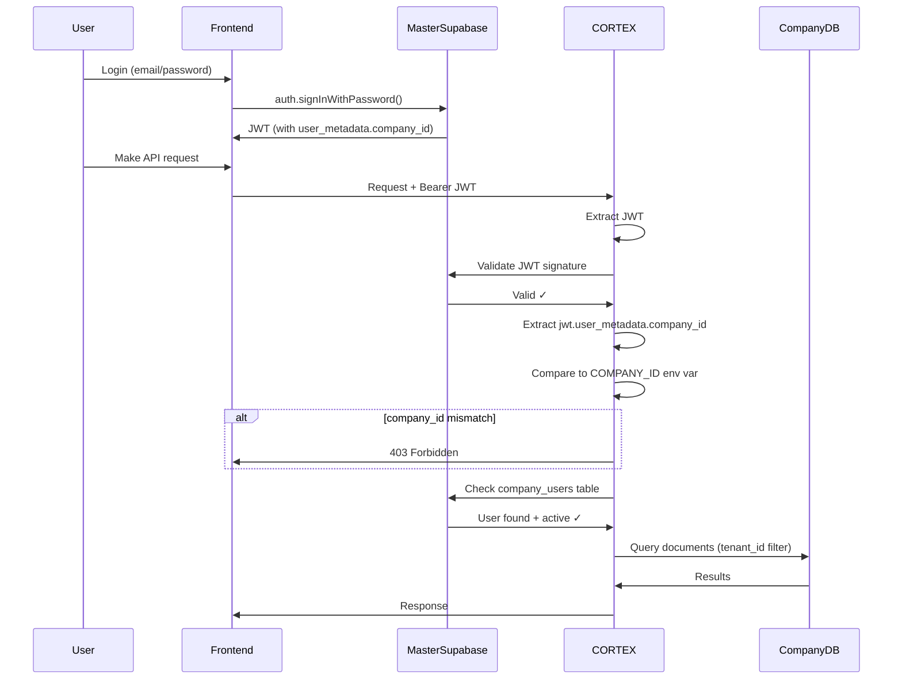

# CORTEX Security Architecture

**Document Version**: 1.0
**Last Updated**: November 2025
**Classification**: Internal - Architecture Documentation

---

## Table of Contents

1. [Executive Summary](#executive-summary)
2. [System Overview](#system-overview)
3. [Multi-Tenant Isolation Architecture](#multi-tenant-isolation-architecture)
4. [Authentication & Authorization](#authentication--authorization)
5. [Data Isolation & Access Control](#data-isolation--access-control)
6. [OAuth & Integration Security](#oauth--integration-security)
7. [Threat Model & Defense Strategy](#threat-model--defense-strategy)
8. [Security Guarantees](#security-guarantees)
9. [Audit & Compliance](#audit--compliance)

---

## Executive Summary

CORTEX is a multi-tenant RAG (Retrieval-Augmented Generation) platform that processes sensitive business data from email (Outlook, Gmail), cloud storage (Google Drive), and financial systems (QuickBooks). This document outlines our defense-in-depth security architecture designed to provide **cryptographic isolation** between tenants while enabling centralized authentication and management.

### Key Security Properties

- **Zero Trust Multi-Tenancy**: One customer CANNOT access another customer's data under any circumstances
- **Cryptographic Binding**: JWT-based company isolation (not just database checks)
- **Infrastructure Isolation**: Each company runs on separate Render deployments
- **Defense in Depth**: Multiple security layers (JWT validation, database checks, environment variables)
- **Complete Data Sovereignty**: Documents stay in customer's own Supabase instance

---

## System Overview

### Architecture Components

```
┌─────────────────────────────────────────────────────────────────┐
│                        CLIENT LAYER                              │
│  ┌──────────────┐     ┌──────────────┐     ┌──────────────┐    │
│  │   Frontend   │     │   Frontend   │     │   Frontend   │    │
│  │  Company A   │     │  Company B   │     │  Company C   │    │
│  └──────────────┘     └──────────────┘     └──────────────┘    │
└────────────┬────────────────────┬────────────────────┬──────────┘
             │                    │                    │
             │    ALL AUTH VIA MASTER SUPABASE         │
             │                    │                    │
             ▼                    ▼                    ▼
┌─────────────────────────────────────────────────────────────────┐
│                    MASTER CONTROL PLANE                          │
│  ┌────────────────────────────────────────────────────────────┐ │
│  │              Master Supabase (Auth + Config)               │ │
│  │  • Authentication (auth.users)                             │ │
│  │  • Company Mapping (company_users table)                   │ │
│  │  • OAuth Tracking (nango_original_connections)             │ │
│  │  • Company Config (companies, deployments)                 │ │
│  └────────────────────────────────────────────────────────────┘ │
└─────────────────────────────────────────────────────────────────┘
             │                    │                    │
    JWT w/company_id      JWT w/company_id      JWT w/company_id
             │                    │                    │
             ▼                    ▼                    ▼
┌─────────────────────────────────────────────────────────────────┐
│                    CORTEX BACKEND LAYER                          │
│  ┌──────────────┐     ┌──────────────┐     ┌──────────────┐    │
│  │   CORTEX A   │     │   CORTEX B   │     │   CORTEX C   │    │
│  │ (Render Pod) │     │ (Render Pod) │     │ (Render Pod) │    │
│  │ COMPANY_ID=A │     │ COMPANY_ID=B │     │ COMPANY_ID=C │    │
│  └──────────────┘     └──────────────┘     └──────────────┘    │
│  Each validates:                                                 │
│  1. JWT signature (Master Supabase)                             │
│  2. jwt.company_id == COMPANY_ID (env var)                      │
│  3. User in company_users table                                 │
└─────────────────────────────────────────────────────────────────┘
             │                    │                    │
             ▼                    ▼                    ▼
┌─────────────────────────────────────────────────────────────────┐
│                    DATA STORAGE LAYER                            │
│  ┌──────────────┐     ┌──────────────┐     ┌──────────────┐    │
│  │  Company A   │     │  Company B   │     │  Company C   │    │
│  │  Supabase    │     │  Supabase    │     │   Postgres   │    │
│  │  (Docs/KG)   │     │  (Docs/KG)   │     │   (Docs/KG)  │    │
│  └──────────────┘     └──────────────┘     └──────────────┘    │
│  Complete data isolation - each company owns their database      │
└─────────────────────────────────────────────────────────────────┘
```

### What Data Lives Where

| Data Type | Storage Location | Access Control | Encryption |
|-----------|-----------------|----------------|------------|
| **User Credentials** | Master Supabase (auth.users) | Supabase Auth | At rest + in transit |
| **User→Company Mapping** | Master Supabase (company_users) | RLS + Service Role | At rest + in transit |
| **OAuth Connections** | Master Supabase (nango_original_connections) | RLS + Service Role | At rest + in transit |
| **Documents/Emails** | Company Supabase/Postgres | COMPANY_ID isolation | At rest + in transit |
| **Knowledge Graph** | Company Supabase/Postgres | COMPANY_ID isolation | At rest + in transit |
| **Vector Embeddings** | Qdrant (per-company collection) | Collection-level isolation | At rest + in transit |
| **OAuth Tokens** | Nango (per-tenant) | Tenant-level isolation | Encrypted at rest |

---

## Multi-Tenant Isolation Architecture

### Infrastructure-Level Isolation

Each company gets their own **isolated infrastructure stack**:

```yaml
Company A:
  - Render Service: cortex-company-a.onrender.com
  - Environment: COMPANY_ID=uuid-a
  - Database: company-a.supabase.co
  - Qdrant Collection: company-a-vectors
  - Nango Tenant: user-uuid-a

Company B:
  - Render Service: cortex-company-b.onrender.com
  - Environment: COMPANY_ID=uuid-b
  - Database: company-b.supabase.co
  - Qdrant Collection: company-b-vectors
  - Nango Tenant: user-uuid-b
```

**Why This Matters**:
- Even if attacker compromises JWT validation, they hit the wrong infrastructure
- Network-level isolation (separate pods, processes, databases)
- No shared memory or filesystem between companies

### Environment Variable Binding

Each CORTEX deployment has a hardcoded `COMPANY_ID` environment variable:

```python
# Set once at deployment, immutable at runtime
COMPANY_ID = os.getenv("COMPANY_ID")  # e.g., "f10541a7-ca6c-4296-a12d-ef92647ae7cb"

# This MUST match the JWT company_id
if jwt.user_metadata.company_id != COMPANY_ID:
    raise HTTPException(status_code=403, detail="Forbidden")
```

**Attack Scenario Prevented**:
- Attacker cannot modify `COMPANY_ID` without redeploying infrastructure
- Even with database access, attacker cannot change which company a deployment serves

---

## Authentication & Authorization

### Centralized Authentication Flow



### JWT Structure & Cryptographic Binding

**JWT Payload** (issued by Master Supabase):
```json
{
  "sub": "550e8400-e29b-41d4-a716-446655440000",
  "email": "nico@unitindustries.com",
  "user_metadata": {
    "company_id": "f10541a7-ca6c-4296-a12d-ef92647ae7cb"
  },
  "iat": 1699564800,
  "exp": 1699651200
}
```

**Signed with Master Supabase's secret key** → Cannot be tampered without invalidating signature

### Security Validation Layers

**Layer 1: JWT Signature Validation**
```python
# Validates JWT was issued by Master Supabase
response = master_supabase.auth.get_user(token)
if not response.user:
    raise HTTPException(status_code=401, detail="Invalid token")
```

**Layer 2: Cryptographic Company Binding**
```python
# Extract company_id from JWT (cryptographically signed)
jwt_company_id = response.user.user_metadata.get("company_id")

# CRITICAL: Must match COMPANY_ID environment variable
if jwt_company_id != master_config.company_id:
    logger.warning(f"JWT company_id mismatch: {jwt_company_id} != {master_config.company_id}")
    raise HTTPException(status_code=403, detail="Access denied")
```

**Layer 3: Database Validation (Defense in Depth)**
```python
# Verify user in company_users table
company_user = master_supabase.table("company_users")\
    .select("id, role")\
    .eq("user_id", user_id)\
    .eq("company_id", master_config.company_id)\
    .eq("is_active", True)\
    .maybe_single()\
    .execute()

if not company_user.data:
    raise HTTPException(status_code=403, detail="Access denied")
```

### Why Three Layers?

| Layer | Purpose | What It Defends Against |
|-------|---------|------------------------|
| **JWT Signature** | Ensure token was issued by Master Supabase | Forged tokens, replay attacks |
| **JWT company_id** | Cryptographically bind user to company | Database tampering, compromised company_users table |
| **Database Check** | Verify active membership | Disabled users, role changes |

---

## Data Isolation & Access Control

### Tenant Isolation Model

Every document in CORTEX has a `tenant_id` field (user's UUID from Master Supabase):

```sql
-- documents table (in Company Supabase/Postgres)
CREATE TABLE documents (
    id uuid PRIMARY KEY,
    tenant_id uuid NOT NULL,  -- User's UUID from Master Supabase
    title text,
    content text,
    source text,  -- 'outlook', 'gmail', 'drive', 'quickbooks'
    created_at timestamp with time zone DEFAULT now()
);

CREATE INDEX idx_documents_tenant ON documents(tenant_id);
```

**All queries are filtered by tenant_id**:
```python
# Backend automatically adds tenant filter
def get_user_documents(user_id: str, supabase: Client):
    return supabase.table("documents")\
        .select("*")\
        .eq("tenant_id", user_id)\  # REQUIRED on every query
        .execute()
```

### Cross-Company Data Access: Impossible

**Scenario**: Attacker from Company A tries to access Company B's data

1. **JWT company_id check fails**: Company B's CORTEX sees `jwt.company_id = "company-a-uuid"`, expects `"company-b-uuid"` → 403
2. **Even if attacker modifies `company_users` table**: JWT signature validation fails because `company_id` is cryptographically signed
3. **Even if attacker compromises Master Supabase**: Company B's data lives in a completely separate database that Company A's CORTEX cannot connect to

### Data Sovereignty

Companies control where their data lives:

```yaml
# Unit Industries
SUPABASE_URL: https://unit-industries.supabase.co
SUPABASE_SERVICE_KEY: their-key

# Or bring your own Postgres
DATABASE_URL: postgresql://their-postgres.aws.com/cortex
```

**CORTEX never stores customer data centrally**. All documents, embeddings, and knowledge graph entries live in the customer's infrastructure.

---

## OAuth & Integration Security

### OAuth Connection Architecture

CORTEX uses **Nango** as an OAuth proxy to connect to Gmail, Outlook, Google Drive, and QuickBooks.

#### Nango Connection Model

```
User (tenant_id: uuid) → Nango Connection → Provider (Gmail/Outlook/Drive/QuickBooks)
                            ↓
              nango_original_connections table (Master Supabase)
              • Tracks original connection email
              • Enforces same-email reconnection
              • Audit logs all connection events
```

**Key Security Properties**:
1. **Tenant Isolation**: Each user gets unique `tenant_id` in Nango
2. **Email Binding**: Users must reconnect with same email (prevents account takeover)
3. **Token Storage**: OAuth refresh tokens encrypted at rest in Nango
4. **Scope Minimization**: Request only necessary permissions (read-only email, read-only drive)

### What CORTEX Can Access

| Integration | Permissions | What We Sync | What We DON'T Access |
|------------|-------------|--------------|---------------------|
| **Outlook** | `Mail.Read`, `User.Read` | Emails (metadata + body) | Cannot send emails, cannot delete emails |
| **Gmail** | `gmail.readonly` | Emails (metadata + body) | Cannot send emails, cannot delete emails |
| **Google Drive** | `drive.readonly` | Files (PDFs, Docs, Sheets) | Cannot modify files, cannot delete files |
| **QuickBooks** | `com.intuit.quickbooks.accounting` | Invoices, Bills, Payments | Read-only access, cannot modify transactions |

### OAuth Token Security

```yaml
Token Storage:
  - Location: Nango (encrypted at rest)
  - Encryption: AES-256
  - Access Control: Per-tenant isolation
  - Rotation: Automatic via refresh tokens
  - Expiry: Short-lived access tokens (1 hour)

Connection Tracking:
  - Table: nango_original_connections (Master Supabase)
  - Purpose: Enforce same-email reconnection
  - Audit: All connection events logged
```

### Admin Sync Triggering

Admins can trigger syncs for users via authenticated endpoints:

```python
@router.post("/admin/connectors/sync")
async def trigger_manual_sync(
    session_id: str = Depends(verify_admin_session),
    supabase: Client = Depends(get_supabase),
    user_id: str = None,
    provider: str = None
):
    """
    Trigger sync for specific user.

    Security:
    - Requires admin PIN authentication (2525)
    - Session tokens expire after 1 hour
    - All actions logged to audit_log_global
    - Rate limited (5 login attempts per 15 min)
    """
    # Create sync job
    job = supabase.table("sync_jobs").insert({
        "user_id": user_id,
        "job_type": provider,
        "status": "queued"
    }).execute()

    # Enqueue Dramatiq task (uses user's OAuth tokens from Nango)
    sync_outlook_task.send(user_id, job.data[0]["id"])

    # Audit log
    await log_admin_action(
        supabase=supabase,
        session_id=session_id,
        action="trigger_sync",
        resource_type="connector",
        resource_id=job.data[0]["id"],
        details={"user_id": user_id, "provider": provider}
    )
```

**What Admin Can Do**:
- Trigger syncs for users (uses their existing OAuth connections)
- View connection status
- View sync job history

**What Admin CANNOT Do**:
- Read user emails/documents directly
- Modify OAuth connections
- Access data without proper JWT (admin endpoints separate from user data endpoints)

---

## Threat Model & Defense Strategy

### Threats We Defend Against

#### 1. Cross-Tenant Data Access

**Threat**: User from Company A attempts to access Company B's data

**Attack Vectors**:
- Modify JWT to change `company_id`
- Modify `company_users` table to grant access
- Send requests directly to Company B's CORTEX

**Defense**:
- ✅ JWT signature validation (cannot forge `company_id` without Master Supabase's secret key)
- ✅ Cryptographic binding (`jwt.company_id` must match `COMPANY_ID` env var)
- ✅ Database validation (user must be in `company_users` table)
- ✅ Infrastructure isolation (Company B's data lives in separate database)

**Verdict**: **PROTECTED** - Multiple independent security layers

---

#### 2. JWT Token Theft/Replay

**Threat**: Attacker steals user's JWT and replays it

**Attack Vectors**:
- Network interception (MITM)
- XSS attack on frontend
- Compromised client device

**Defense**:
- ✅ HTTPS everywhere (TLS 1.3)
- ✅ Short-lived JWTs (1 hour expiry)
- ✅ HttpOnly cookies (where applicable)
- ✅ JWT tied to specific company via `company_id`

**Limitations**:
- ⚠️ If attacker steals valid JWT within expiry window, they can make requests as that user
- ⚠️ No additional device fingerprinting or IP validation

**Mitigation**:
- Short expiry window limits blast radius
- Audit logs capture all API requests
- User can revoke session via logout

**Verdict**: **PARTIALLY PROTECTED** - Standard JWT security model

---

#### 3. Database Compromise (Master Supabase)

**Threat**: Attacker gains access to Master Supabase database

**What Attacker Could Do**:
- Read `company_users` table (see user→company mappings)
- Modify `company_users` table (grant themselves access to other companies)
- Read OAuth connection metadata

**What Attacker CANNOT Do**:
- ❌ Access company documents (stored in separate Company Supabase instances)
- ❌ Forge JWTs with valid `company_id` (requires Master Supabase signing key, not just database access)
- ❌ Bypass `jwt.company_id` validation (cryptographically signed)

**Defense**:
- ✅ JWT cryptographic binding (even with database access, cannot forge valid `company_id`)
- ✅ Infrastructure isolation (documents in separate databases)
- ✅ Minimal data in Master Supabase (no documents, just mappings)

**Verdict**: **PROTECTED** - Documents safe even if Master Supabase compromised

---

#### 4. OAuth Token Compromise

**Threat**: Attacker gains access to user's OAuth tokens (Gmail, Outlook, Drive)

**Attack Vectors**:
- Compromise Nango infrastructure
- Steal tokens from database

**What Attacker Could Do**:
- Read user's emails/files via OAuth provider APIs
- Sync new data into CORTEX

**Defense**:
- ✅ Tokens encrypted at rest in Nango (AES-256)
- ✅ Scope minimization (read-only permissions)
- ✅ Audit logging (all sync operations logged)
- ✅ Same-email reconnection enforcement

**Limitations**:
- ⚠️ If Nango is compromised, attacker could access OAuth tokens
- ⚠️ CORTEX trusts Nango's security model

**Mitigation**:
- Nango is SOC 2 Type II certified
- Tokens can be revoked by user at provider level
- Read-only scopes limit damage

**Verdict**: **TRUSTED THIRD PARTY** - Relies on Nango's security

---

#### 5. CORTEX Backend Compromise (Single Company)

**Threat**: Attacker compromises one company's CORTEX deployment

**What Attacker Could Access**:
- That company's documents/data
- That company's OAuth connections
- That company's vector embeddings

**What Attacker CANNOT Access**:
- ❌ Other companies' data (separate infrastructure, databases)
- ❌ Other companies' OAuth tokens (separate Nango tenant IDs)
- ❌ Master Supabase signing keys

**Defense**:
- ✅ Infrastructure isolation (compromise limited to single company)
- ✅ Separate databases per company
- ✅ Separate Nango tenants per user

**Verdict**: **BLAST RADIUS LIMITED** - Compromise affects only one company

---

#### 6. Insider Threat (Malicious Admin)

**Threat**: CORTEX admin with access to Master Supabase attempts to access customer data

**What Admin Could Do**:
- View `company_users` mappings
- View OAuth connection metadata
- Trigger syncs for users

**What Admin CANNOT Do**:
- ❌ Read customer documents (stored in Company Supabase, admin has no access)
- ❌ Bypass JWT validation (CORTEX validates JWT cryptographically)
- ❌ Access company databases (credentials stored as env vars in Render, not accessible to admin)

**Defense**:
- ✅ Data sovereignty (documents in customer's infrastructure)
- ✅ Audit logging (all admin actions logged)
- ✅ Minimal admin permissions (cannot access customer databases)

**Verdict**: **PROTECTED** - Admin cannot access customer documents

---

### Threats We DON'T Defend Against

| Threat | Why Not Defended | Recommendation |
|--------|-----------------|----------------|
| **Compromised User Device** | Cannot control client-side security | Users should use secure devices, enable 2FA at provider level |
| **Social Engineering** | Cannot prevent users from sharing credentials | User training, encourage password managers |
| **Malicious Customer Admin** | Customers control their own Supabase | Customers should implement proper access controls |
| **DDoS Attacks** | Not implemented yet | Future: Cloudflare, rate limiting per-IP |

---

## Security Guarantees

### What We Guarantee

✅ **Zero Cross-Tenant Data Leakage**: User from Company A CANNOT access Company B's data under any circumstances

✅ **Cryptographic Isolation**: JWT-based company binding prevents tampering even if database is compromised

✅ **Infrastructure Isolation**: Each company runs on separate infrastructure (compute, storage, network)

✅ **Data Sovereignty**: Customer documents never leave their own database

✅ **Audit Trail**: All API requests, admin actions, and OAuth events logged

✅ **OAuth Security**: Read-only permissions, encrypted tokens, same-email reconnection enforcement

### What We DON'T Guarantee

⚠️ **Protection Against Compromised OAuth Tokens**: If user's Gmail/Outlook is compromised, attacker can access their data

⚠️ **Protection Against Nango Compromise**: We trust Nango's security model for OAuth token storage

⚠️ **Protection Against Customer Database Compromise**: If customer's Supabase is compromised, their data is at risk (but other customers are safe)

⚠️ **Protection Against Valid JWT Theft**: If attacker steals valid JWT, they can impersonate user for duration of token (1 hour)

---

## Audit & Compliance

### Audit Logging

All security-relevant events are logged to Master Supabase `audit_log_global` table:

```sql
CREATE TABLE audit_log_global (
    id uuid PRIMARY KEY DEFAULT gen_random_uuid(),
    company_id uuid REFERENCES companies(id),
    admin_id uuid REFERENCES master_admins(id),
    user_id uuid,  -- For user actions
    action text NOT NULL,  -- 'login', 'trigger_sync', 'connect_oauth', etc.
    resource_type text,  -- 'connector', 'sync_job', 'document'
    resource_id text,
    details jsonb,
    ip_address text,
    user_agent text,
    created_at timestamp with time zone DEFAULT now()
);
```

**Events Logged**:
- User authentication (success/failure)
- OAuth connections (create, reconnect, disconnect)
- Sync operations (trigger, start, complete, fail)
- Admin actions (trigger sync, view status)
- API errors (401, 403, 500)

### Compliance Considerations

| Standard | Status | Notes |
|----------|--------|-------|
| **GDPR** | ⚠️ Partial | Customer controls data, CORTEX processes on behalf of customer |
| **HIPAA** | ❌ Not Compliant | No BAA in place, not recommended for PHI |
| **SOC 2** | ⚠️ In Progress | Depends on Nango (SOC 2), Supabase (SOC 2), Render |
| **ISO 27001** | ❌ Not Certified | - |

**Recommendations for Customers**:
- Review data processing agreement (DPA) before deploying
- Enable encryption at rest on Company Supabase
- Implement backup/disaster recovery for company database
- Use private Render instances for sensitive workloads

---

## Security Best Practices

### For CORTEX Operators

1. **Never log sensitive data**: No passwords, JWTs, OAuth tokens in logs
2. **Rotate secrets regularly**: Master Supabase service key, Nango secret key
3. **Monitor audit logs**: Set up alerts for suspicious patterns
4. **Limit admin access**: Use PIN-based admin auth, rotate PIN regularly
5. **Test security**: Regular penetration testing, security audits

### For Customers

1. **Use strong passwords**: Enable 2FA on Master Supabase user accounts
2. **Review OAuth connections**: Disconnect unused integrations
3. **Monitor sync jobs**: Set up alerts for failed syncs
4. **Backup your data**: Regular backups of Company Supabase
5. **Control access**: Use company_users table to manage who has access

---

## Incident Response

### In Case of Security Breach

**Step 1: Containment**
- Identify compromised company/user
- Revoke affected JWTs (delete sessions in Master Supabase)
- Disable affected OAuth connections (via Nango)
- Isolate compromised CORTEX deployment if needed

**Step 2: Investigation**
- Review audit logs (audit_log_global table)
- Identify blast radius (which data was accessed)
- Determine attack vector (JWT theft, database compromise, etc.)

**Step 3: Notification**
- Notify affected customers within 24 hours
- Provide details on what data was compromised
- Recommend remediation actions (password reset, OAuth reconnection)

**Step 4: Remediation**
- Patch vulnerability
- Rotate compromised secrets
- Update security procedures
- Conduct post-mortem

### Contact

**Security Issues**: security@highforce.ai
**General Support**: support@highforce.ai

---

## Conclusion

CORTEX's security architecture provides **defense-in-depth** multi-tenant isolation through:

1. **Cryptographic Binding**: JWT-based company isolation
2. **Infrastructure Isolation**: Separate deployments, databases, and OAuth tenants
3. **Data Sovereignty**: Customer documents never leave their infrastructure
4. **Audit Logging**: Complete visibility into all security events

While no system is 100% secure, CORTEX's architecture ensures that **compromise of one component does not cascade to others**, limiting blast radius and providing strong isolation guarantees for multi-tenant deployments.

---

**Document History**:
- v1.0 (Nov 2025): Initial security architecture documentation
